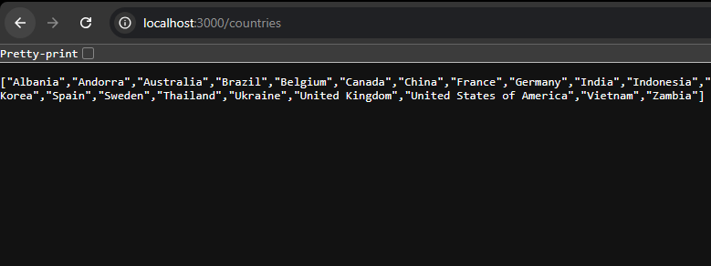
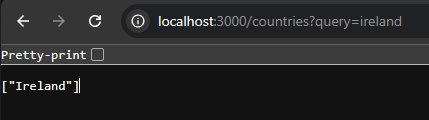
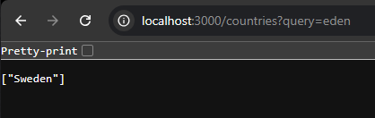
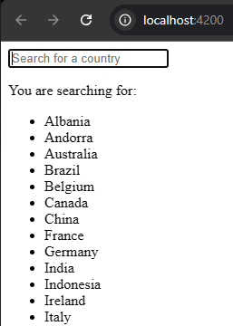
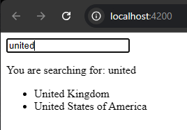

# Country Search Web Application

A simple web application that allows users to search for countries
using a search bar. The application utilises Angular for the
frontend and Node.js with SQLite for the backend.

## Table of Contents
- [Features](#features)
- [Technologies Used](#technologies-used)
- [Installation](#installation)
- [Usage](#usage)
- [API Endpoints](#api-endpoints)
- [API Endpoint Screenshot](#api-endpoint-screenshot)

## Features
- Search for countries by name.
- Display a list of all countries.
- Responsive design for better user experience.

## Technologies Used
- **Frontend:** Angular 18
- **Backend:** Nodejs, Express
- **Database:** SQLite
- **HTTP Client:** HttpClient for making API requests
- **Package Manager:** npm

## Installation
1. Clone the repository:
    ```bash
    git clone https://github.com/r-richard404/WebAppAssessmentWorkHuman.git

2. Navigate to the project directory:
    cd country-search-app

3. Install the dependencies for both frontend and backend
    npm install
    cd country-search-backend
    npm install

## Usage
1. Start the backend server
    node server.js
    - The server will run on http://localhost:3000

2. Start the Angular frontend:
    ng serve
    - Open your browser and navigate to http://localhost:4200 to view the application

## API Endpoints
- GET /countries: Retrieves a list of all countries.
- GET /countries?query=countryName: Searches for countries based on a query. The search is case-insensitive

## API Endpoint Screenshot

**Description:** This screenshot demonstrates the response from the Country Search API endpoint at `http://localhost:3000/countries` without any query parameter. It displays the complete list of countries retrieved from the database, showcasing the default functionality of the API when accessed without a search query.


**Description:** This screenshots demonstrates the API response when searching for a country with a case-insensitive query. The API returns the matching countries regardless of the letter case used in the query.


**Description:** This screenshot illustrates the API response when searching for the query "eden". The API successfully returns "Sweden", highlighting its capability to match substrings within country names.

 
**Description:** This screenshot shows the default application page where all the countries are listed. When querying for "united" the application correctly returns both "United Kingdom" and "United States of America", highlighting the matching capabilities of the search functionality within the front-end.